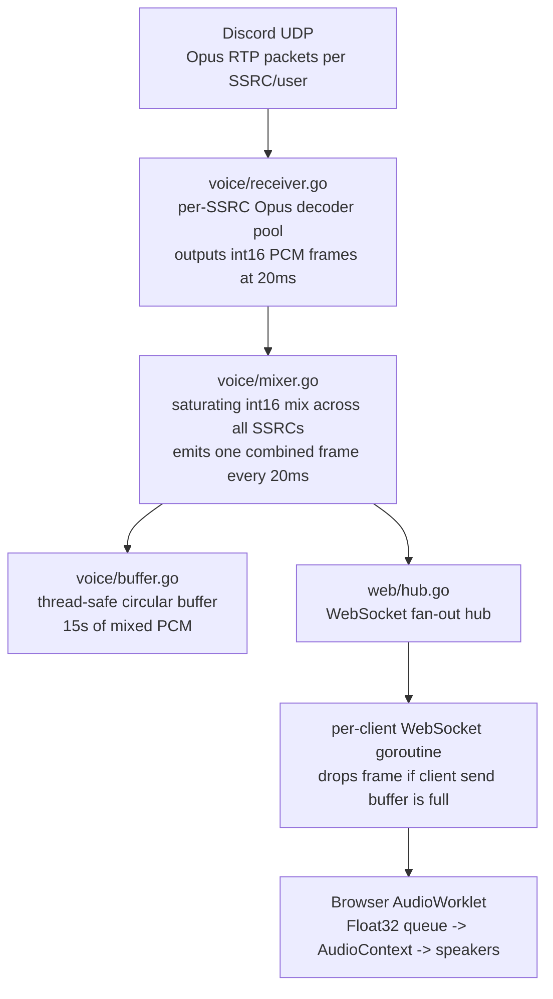
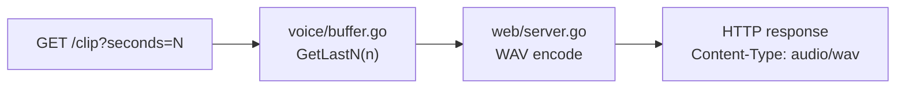
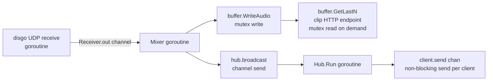

# Echo

A Discord voice audio proxy that captures all channel members' audio from the bot's perspective, mixes them into a single combined stream, and delivers it in real-time to a web dashboard — with a 15-second circular buffer for instant clipping.

---

## Goal

When a Discord bot is present in a voice channel it receives a separate Opus stream per user (keyed by SSRC). Echo decodes those streams, mixes them into one combined PCM output (simulating what you'd hear sitting in the channel), and proxies that output live to any browser that connects to the web dashboard. A circular buffer always holds the last 15 seconds of mixed audio so a clip can be extracted at any moment without interrupting the live stream.

Primary use case: real-time monitoring and clipping of Discord voice calls for sync with pre-recorded footage, highlights, or moderation.

---

## Requirements

### Functional

- **Voice join/leave**: The bot joins a Discord voice channel on demand (via bot command or HTTP endpoint) and leaves on request or when the channel empties.
- **Per-user Opus decode**: Each speaking user in the channel is identified by a unique SSRC. The bot maintains a dedicated Opus decoder per SSRC for the lifetime of that user's speaking session.
- **PCM mixing**: All active decoded PCM streams are mixed into a single stereo 48 kHz int16 stream. Mixing is saturating (clamped to ±32767) to prevent integer overflow distortion.
- **Circular buffer**: 15 seconds of mixed PCM (2,880,000 bytes at 48 kHz × 2 channels × 2 bytes) is kept in a thread-safe circular buffer at all times, overwriting the oldest audio when full.
- **Live WebSocket stream**: The mixed stream is broadcast as raw binary PCM frames to all connected browser clients in real-time. Each push is one 20 ms frame (3,840 bytes: 960 samples × 2 channels × 2 bytes/sample).
- **Clip endpoint**: `GET /clip?seconds=N` (1 ≤ N ≤ 15) returns the last N seconds of mixed audio as a valid WAV file for download.
- **Web dashboard**: A minimal browser UI shows connection status, a live VU meter, a playback toggle, and a clip button.
- **Multi-guild support**: The existing `activeConnections` registry is preserved; each guild gets its own pipeline. The web UI selects which guild to listen to.

### Non-functional

- **No FFmpeg**: All codec work is native Go or CGo only. No subprocess calls.
- **Low latency**: End-to-end latency from Discord audio packet arrival to browser playback shall be under 500 ms.
- **Non-blocking broadcast**: Slow or lagging WebSocket clients must not stall the audio pipeline. Frames are dropped for clients whose write buffers are full.
- **Safe concurrency**: The audio write path (receiver -> mixer -> buffer) and the read paths (WebSocket broadcast, clip endpoint) must not race. All shared state is guarded by mutexes or channels.
- **Graceful degradation**: If no clients are connected the pipeline runs silently (still feeds the buffer). If no users are speaking the buffer fills with silence frames.

---

## Libraries and External Dependencies

### Go modules to add

| Module | Purpose | CGo? |
|---|---|---|
| `github.com/hraban/opus` | libopus bindings -- Opus to PCM decode per SSRC | Yes (CGo) |
| `github.com/go-audio/wav` | WAV file encoder for clip downloads | No |

**System library required:** `libopus-dev` (Debian/Ubuntu) or `opus-devel` (Fedora/RHEL). Install before `go build`. The `hraban/opus` package wraps `libopus.so` via CGo.

### Already present (keep as-is)

| Module | Used for |
|---|---|
| `github.com/disgoorg/disgo` | Discord Gateway + voice UDP connection |
| `github.com/disgoorg/godave` | Transitive disgo dep — investigate if it surfaces audio utilities that overlap with `hraban/opus` before adding opus separately |
| `github.com/gorilla/websocket` | WebSocket server upgrade + send/receive |
| `github.com/joho/godotenv` | `.env` loading |

### Browser APIs (no npm, no bundler)

| API | Used for |
|---|---|
| `WebSocket` | Receive binary PCM frames from Go server |
| `AudioContext` + `AudioWorklet` | Schedule and play incoming PCM in real-time |
| `AnalyserNode` | VU meter rendering |

The entire frontend is vanilla HTML + JS served from an embedded `embed.FS`. No Node.js, no build step.

---

## Architecture

### Live stream path



### Clip path



---

## Modules

### `voice/` — Audio pipeline

#### `voice/conn.go` *(existing, extend)*

Current: manages the `activeConnections` map and opens/closes the disgo `voice.Conn`.

Needed additions:
- After `voiceConn.Open(...)` succeeds, wire up the `Receiver` (see below) and `Mixer` to this connection.
- Change `Open` call from `selfMute: true` to `selfMute: false` if the bot should also be able to speak in the future; for pure listening `selfMute: true` and `selfDeaf: false` is already correct.
- `Connection` struct gains `Receiver *Receiver` and `Mixer *Mixer` fields so they are owned by and scoped to the connection.

#### `voice/buffer.go` *(existing, extend)*

Current: correct circular buffer logic for `[]byte` PCM.

Needed additions:
- Add `sync.RWMutex` — `WriteAudio` takes a write lock; `GetAudio`/`GetLastN` take a read lock. This is currently unsynchronised and will race.
- Add `GetLastN(seconds float64) []byte` — returns only the most recent N seconds' worth of data rather than the full 15 s, used by the clip endpoint.
- Keep the `[]byte` interface (int16 PCM serialised little-endian) to stay wire-compatible with the WAV encoder and WebSocket frames.

#### `voice/receiver.go` *(new)*

Responsibility: receive raw Opus packets from disgo's `voice.Conn`, maintain a per-SSRC `opus.Decoder` (from `hraban/opus`), decode each packet to `[]int16`, and forward the frame to the Mixer.

Key types:

```go
type Receiver struct {
    mu       sync.Mutex
    decoders map[uint32]*opus.Decoder  // SSRC -> decoder
    out      chan Frame                 // decoded frames to Mixer
}

type Frame struct {
    SSRC    uint32
    PCM     []int16  // 960 stereo samples = 1920 int16 values
    Missing bool     // true if this is a synthesised silence frame (no packet arrived)
}
```

Submodule responsibilities:
- `Start(conn voice.Conn)` — registers the packet receive handler on the disgo connection. disgo's `voice.Conn` delivers received UDP packets through an `OpusFrameReceiver` callback or equivalent interface (exact method name to be confirmed against disgo v0.19 source; look for `SetReceiveOpus` or a `voice.UserPacketHandler`).
- On each packet: look up or create an `opus.Decoder` for the packet's SSRC; call `decoder.DecodeInt16(opusBytes, pcmBuf, false)` (DTX-safe); send the resulting `Frame` to `out`.
- `Stop()` — closes `out`, tears down decoders.
- The `out` channel is unbuffered or has a depth of 3 frames per expected concurrent speaker. Drop frames (log a warning) rather than block if the Mixer is not consuming fast enough.

Opus decoder parameters: 48000 Hz, 2 channels. Frame size 960 samples (20 ms). These match Discord's fixed encoding parameters.

#### `voice/mixer.go` *(new)*

Responsibility: consume `Frame` values from `Receiver.out`, accumulate one 20 ms mixing window, produce a single mixed `[]int16` frame every 20 ms, then write it to the `Buffer` and push it to `Hub`.

Key design:
- A ticker fires every 20 ms. On each tick, all frames that have arrived since the previous tick are mixed together. Frames from the same SSRC that arrived after the tick deadline are held for the next window (they form a trivial 1-frame jitter buffer per SSRC).
- Mixing: for each sample index `i`, `mixed[i] = clamp(sum of active[ssrc][i] for all active SSRCs, -32768, 32767)`.
- Output `[]int16` is serialised to `[]byte` (little-endian) before being written to the Buffer and sent to Hub.
- If no frames arrive in a tick window the mixer emits a silence frame (all zeros) to keep the buffer and stream continuous.

```go
type Mixer struct {
    receiver *Receiver
    buffer   *Buffer
    hub      *web.Hub
    stop     chan struct{}
}
```

`Start()` launches the mixing goroutine. `Stop()` closes `stop` and drains the receiver channel.

---

### `web/` — HTTP and WebSocket server

#### `web/server.go` *(new)*

Responsibility: set up `net/http` routes and serve embedded static files.

Routes:
- `GET /` — serves `static/index.html` from the embedded FS.
- `GET /ws` — upgrades to WebSocket, registers client with Hub.
- `GET /clip` — reads `?seconds=N` (default 15, max 15), calls `buffer.GetLastN(N)`, encodes as WAV using `go-audio/wav`, and returns `Content-Type: audio/wav` with a `Content-Disposition: attachment; filename="clip.wav"` header.
- `GET /status` — returns JSON: `{ "connected": bool, "guild": "...", "channel": "...", "listeners": N }`.

The server is started from `main.go` alongside the Discord gateway. Port is read from `WEB_PORT` env var (default `8080`).

WAV encoding (clip endpoint): `go-audio/wav` wraps a `bytes.Buffer`; write the PCM samples as `audio.IntBuffer` with format `{SampleRate: 48000, NumChannels: 2, BitDepth: 16}`, then serve the buffer bytes. This requires no FFmpeg and no system library.

#### `web/hub.go` *(new)*

Responsibility: maintain the set of active WebSocket connections and broadcast PCM frames to all of them without blocking the audio pipeline.

```go
type Hub struct {
    clients    map[*Client]struct{}
    broadcast  chan []byte   // mixed PCM frames from Mixer
    register   chan *Client
    unregister chan *Client
}

type Client struct {
    conn *websocket.Conn
    send chan []byte  // buffered, depth 5 (100 ms of frames)
}
```

The Hub's `Run()` goroutine selects on register/unregister/broadcast. On broadcast, it iterates clients and does a non-blocking send on each `client.send` channel — if the channel is full the frame is silently dropped for that client (they may hear a brief glitch but the pipeline is not stalled).

Each `Client` has its own write goroutine that drains `client.send` and calls `websocket.WriteMessage(websocket.BinaryMessage, frame)`.

#### `web/static/` *(new, embedded)*

Three files, embedded via `//go:embed static` in `server.go`.

**`index.html`**: Single-page dashboard.
- Status bar (connected/disconnected, guild name, channel name, listener count).
- Play/Pause button (toggles AudioContext playback without closing the WebSocket).
- VU meter canvas (driven by `AnalyserNode`).
- Clip button (calls `GET /clip?seconds=15`, triggers browser file download).
- Clip duration slider (1–15 s).

**`app.js`**: WebSocket + AudioContext coordination.
- Opens `ws://host/ws` on page load.
- Creates `AudioContext` at 48 kHz (matching the server's stream).
- Registers `worklet.js` as an `AudioWorklet` module.
- Creates `AudioWorkletNode` -> `AnalyserNode` -> `destination`.
- On each binary WebSocket message: convert `ArrayBuffer` to `Int16Array`, post to worklet via `port.postMessage({pcm: int16Array}, [int16Array.buffer])` (zero-copy transfer).

**`worklet.js`**: `AudioWorkletProcessor` subclass.
- Maintains a Float32 sample queue (ring buffer, pre-allocated for ~500 ms capacity).
- On `port.onmessage`: converts incoming `Int16Array` to Float32 (divide by 32768), enqueues samples.
- In `process(inputs, outputs)`: dequeues into the stereo output buffer. If the queue underruns (network hiccup), outputs silence — do not throw or stall.
- The queue target depth is ~200 ms (9,600 samples at 48 kHz). If the queue grows beyond 400 ms the processor trims the oldest samples to prevent drifting latency.

---

## Implementation Guidelines

### Audio pipeline concurrency model

The hot path must never block:



Never hold the buffer mutex while writing to a WebSocket and never hold a WebSocket send lock while touching the buffer.

### Opus decoder lifecycle

Create a new `opus.Decoder` the first time a packet arrives from an SSRC. Never share decoders across SSRCs — the Opus codec is stateful and the decoder's internal state tracks continuity for that stream. On voice state update indicating a user left (`VoiceStateUpdate` with `ChannelID = nil`), the corresponding decoder should be removed from the map and closed.

Map the Discord user ID to SSRC via the `VoiceSpeakingUpdate` gateway event (`EventVoiceSpeakingUpdate` in disgo), which disgo fires when a user starts or stops speaking and which includes both `UserID` and `SSRC`. Store this mapping in `Receiver` for logging and status reporting.

### WAV encoding without FFmpeg

WAV is a trivial container: a 44-byte RIFF header followed by raw little-endian int16 PCM samples. The `go-audio/wav` encoder handles this entirely in Go. No system library, no subprocess. The clip endpoint is therefore a pure memory operation: `buffer.GetLastN(N)` -> WAV encode -> `http.ResponseWriter`.

### Handling disgo's voice receive API

In disgo v0.19, the `voice.Conn` receives audio through a packet handler that must be registered after `Open`. The exact method signature should be verified against the disgo v0.19 source (look for `SetReceiveHandler`, `AddReceiveHandler`, or a `ReceiverFunc` option on `VoiceManager.CreateConn`). The received packet type exposes at minimum: `SSRC uint32`, `Opus []byte`, `Sequence uint16`, `Timestamp uint32`. The sequence and timestamp fields can be used for basic packet reordering if needed, but a simple drop-on-late policy is sufficient for v1.

### Thread safety gaps in existing code

- `buffer.go`: no mutex — add `sync.RWMutex` before any concurrent use.
- `utils/discord.go`: `NewDiscord` assigns to a local `DiscordInstance` variable (shadowing the package-level global). The package-level `DiscordInstance` is never set and will be nil when `conn.go` dereferences it. Fix: `DiscordInstance = &Discord{...}` (no `:=`).
- `activeConnections` map in `conn.go`: not protected by a mutex; safe for now because only one goroutine writes it, but add a `sync.RWMutex` before introducing the HTTP status endpoint which reads concurrently.

### Environment variables

| Variable | Default | Description |
|---|---|---|
| `TOKEN` | (required) | Discord bot token |
| `WEB_PORT` | `8080` | HTTP/WebSocket server port |
| `GUILD_ID` | (optional) | Auto-join this guild's voice channel on start |
| `CHANNEL_ID` | (optional) | Auto-join this channel on start (requires `GUILD_ID`) |

### Build prerequisites

```sh
# Debian/Ubuntu
sudo apt-get install libopus-dev

# macOS
brew install opus

# Then standard Go build (CGo enabled by default)
go build ./...
```

CGo is required only for `hraban/opus`. All other code is pure Go.

### Directory structure (target state)

```
Echo/
  main.go
  go.mod
  go.sum
  .env
  utils/
    discord.go
  voice/
    conn.go
    buffer.go
    receiver.go    (new)
    mixer.go       (new)
  web/
    server.go      (new)
    hub.go         (new)
    static/
      index.html   (new)
      app.js       (new)
      worklet.js   (new)
```
